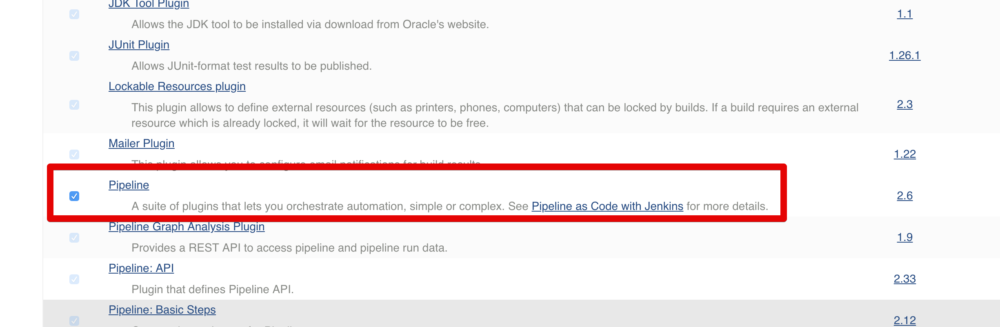
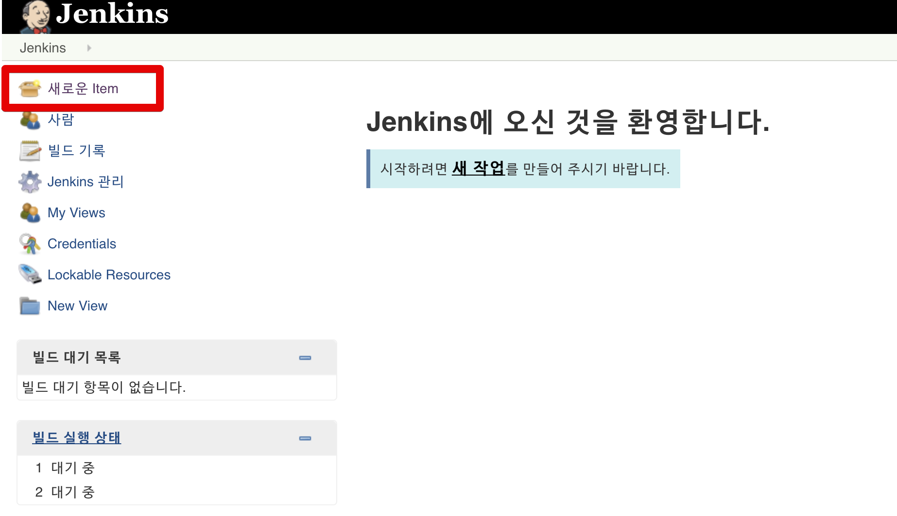
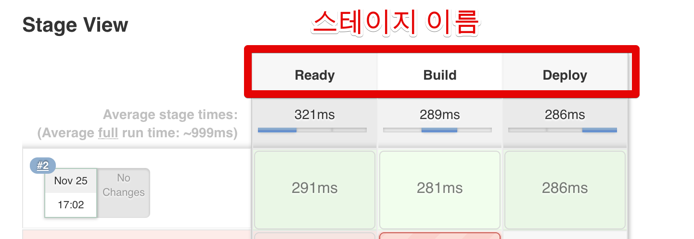
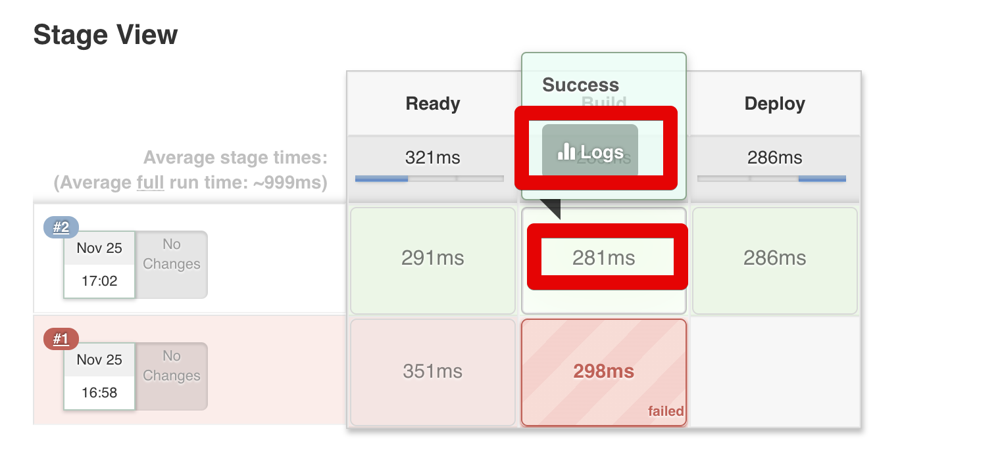
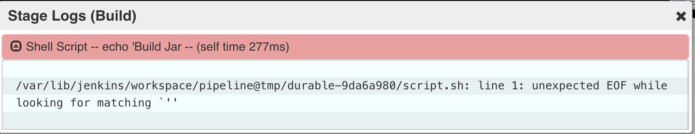

# 젠킨스 파이프라인 정리

안녕하세요? 이번 시간엔 젠킨스 파이프라인을 정리해보려고 합니다.  
모든 코드는 [Github](https://github.com/jojoldu/blog-code/tree/master/jenkins-pipeline)에 있기 때문에 함께 보시면 더 이해하기 쉬우실 것 같습니다.  
  
젠킨스의 파이프라인이란 연속적인 이벤트 혹은 Job의 그룹을 얘기합니다.  
즉, 본인이 만든 젠킨스 Job들을 순차적 혹은 병렬적으로 실행시키거나 특별하게 작성한 스크립트로 이벤트들을 연속적으로 실행시키는 등의 일을 지원하는 기능입니다.

간단히 말해, Jenkins Pipeline은 Jenkins를 사용하여 연속적인 전달 파이프 라인 의 통합 및 구현을 지원하는 플러그인의 조합입니다 . 파이프 라인은 파이프 라인 DSL (Domain-Specific Language)을 통해 간단하거나 복잡한 전달 파이프 라인을 "코드"로 생성 할 수있는 확장 가능한 자동화 서버를 갖추고 있습니다

본인의 서버에 젠킨스가 설치되어있다는 가정하에 시작합니다.  

> 만약 개인 서버가 없어 로컬에서 설치해서 실행해야 한다면 이전에 작성한 [docker를 이용한 CI 구축 연습하기](https://jojoldu.tistory.com/139)를 참고해보세요.

## 1. 파이프라인 샘플 만들어보기

파이프라인을 만들기 전에 Pipeline Plugin이 설치되어있는지 확인해봅니다.  
아래와 같이 **설치된 플러그인 목록에 Pipeline**이 있으면 됩니다.  



설치가 안되어있다면 설치하시고, 설치가 되셨다면 아래 내용을 진행하시면 됩니다.  
  
먼저 젠킨스로 접속하셔서 새로운 item을 선택합니다.



여기서 2번째인 Pipeline을 선택합니다.


Job 설정 화면의 하단으로 가보시면 Pipeline 탭이 있습니다.  
여기에 파이프라인 코드를 작성해야합니다.  
아래 샘플 코드를 그대로 삽입합니다.  


```bash
node {
    stage('Ready') {
        sh "echo 'Ready'"
    }
    
    stage('Build') {
        sh "echo 'Build Jar'"
    }
    
    stage('Deploy') {
        sh "echo 'Deply AWS'"
    }
}
```

> 문법에 대해선 이후 챕터에서 설명 드리겠습니다.

Pipeline 생성이 끝나시면 아래와 같이 Pipeline을 실행해봅니다.


그럼 작성한 코드의 ```stage```에 작성된 이름이 Stage View에 표기됩니다.  
그리고 각 스테이지에서 소요된 시간이 얼마나 되는지도 함께 표기됩니다.



각 스테이지별로 상세 로그가 보고 싶으시면 해당 스테이지를 클릭 -> Logs 버튼 클릭으로 볼 수 있습니다.



성공할 경우 아래와 같이,


실패했다면 아래와 같이 상세한 로그를 볼 수 있습니다.



간단하게 파이프라인을 만들어 보았습니다.  
방금 진행한 샘플의 경우 기존에 생성된 젠킨스 Job들을 이용하지 않고, 파이프라인 자체적인 이벤트들 (```stage```들의 묶음) 이용해보았습니다.  

젠킨스 파이프라인은 2가지 문법을 지원합니다.  
Scripted와 Declarative입니다.  

Scripted 문법의 경우 Groovy로 빌드되기 때문에 일반적으로 파이프라인을 생성하는데 Declarative 보다 훨씬 **유연한 방법**입니다.  
반면, Declarative의 경우 **Scripted보다 훨씬 더 간단하게 작성**할 수 있는 방법입니다.  
대신 고정된 방식으로만 사용해야합니다.  
  
중요한 점은 이 2가지 문법은 **서로 호환되지 않습니다**.  
따라서 scripted 문법을 쓴다면 scripted문법만, declarative문법만 쓴다면 declarative문법만 써야합니다.  
같이 쓰시면 안됩니다.  
  
위에서 사용한 방법은 **Scripted**입니다.  
그래서 먼저 Scripted 문법을 배워보겠습니다.  
