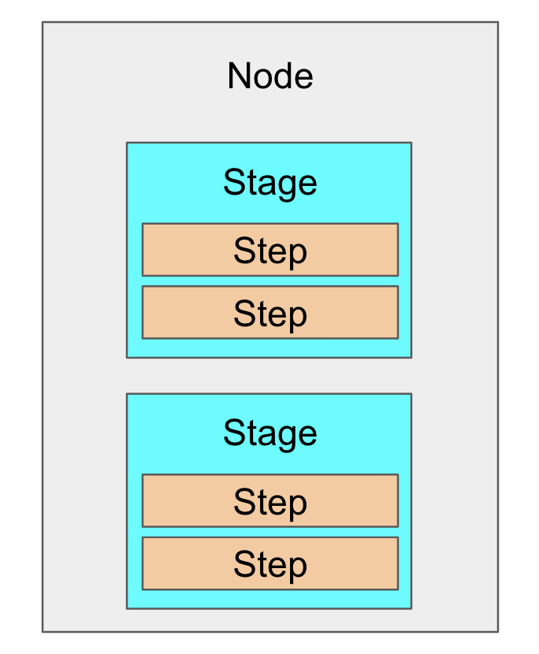
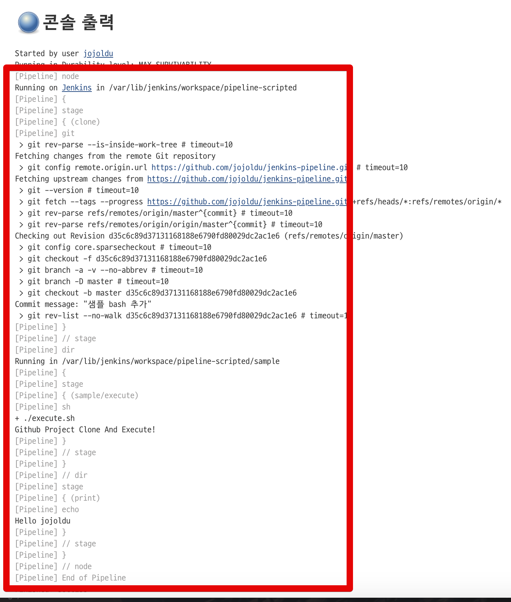
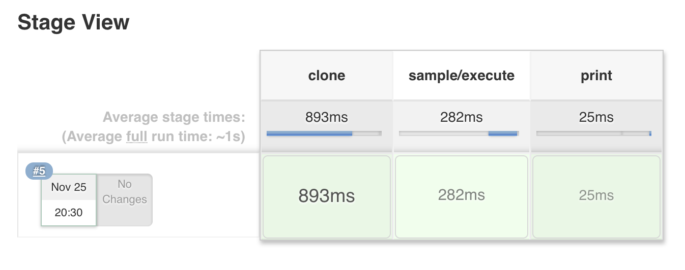

# 2. Scripted 문법

이번 시간에는 젠킨스 파이프라인의 Scripted 문법을 소개드리겠습니다.  
지난 시간에 말씀드린 것처럼 Scripted 문법은 쉘 스크립트를 짜듯이 **자유롭게 파이프라인을 구성**할 수 있도록 지원합니다. Scripted 문법은 **Groovy 문법**을 사용합니다.  
Groovy를 안써보신 분들이더라도 Java나 기타 다른 언어를 써보셨다면 쉽게 이해하실 수 있으시니 걱정하지 않으셔도 됩니다.  
  
2개의 문법이 있다는 것은 서로 사용해야할 때가 다르다는 의미겠죠?  
여기서는 정확히 어떤 때에 2개의 문법을 선택해서 써야하는지 말씀드릴수는 없습니다.  
다만, 이 시리즈에서는 서로의 장점과 단점을 소개해드리겠습니다.  
장단점을 보시고 본인의 상황에 맞게 선택해서 쓰시면 될 것 같습니다.

## 2-1. 장점과 단점

Scripted 문법의 장점과 단점은 다음과 같습니다.

### 장점

* 더 많은 절차적인 코드를 작성 가능
* 프로그램 작성과 흡사
* 기존 파이프 라인 문법이라 친숙하고 이전 버전과 호환 가능
* 필요한 경우 커스텀한 작업 생성이 가능하기 때문에 유연성 좋음
* 보다 복잡한 워크 플로우 및 파이프 라인 모델링 가능

### 단점

* 일반적으로 더 많은 프로그래밍이 필요
* Groovy 언어 및 환경으로 제한된 구문 검사
* 전통적인 젠킨스 모델과는 맞지 않음
* 같은 작업이라면 Declarative 문법보다 잠재적으로 더 복잡

정리하자면 Scripted 문법은 Declarative 문법보다 더 다양한 작업을 생성할 수 있지만, 복잡하고, 유지보수하기 힘든 단점이 있습니다.  
  
장/단점을 소개 했으니, 이제 사용법을 한번 알아보겠습니다.  

## 2-2. 사용법

Scripted 문법에는 별도의 기능을 지원하는 Directive (지시어 정도로 이해해주세요.)가 있습니다.  
이런 Directive를 이용해 필요한 파이프라인 작업들을 작성합니다.  
아래는 대표적인 Directive들 입니다.

| Directive   |  설명   |
|  ---  |  ---  |
|  ```node```     |  Scripted 파이프라인을 실행하는 젠킨스 에이전트 <br> 최상단 선언 필요 <br> 젠킨스 마스터-슬레이브 구조에서는 파라미터로 마스터-슬레이브 정의 가능    |
|  ```dir```     |  명령을 수행할 디렉토리 / 폴더 정의     |
|  ```stage```     |  파이프라인의 각 단계를 얘기하며, 이 단계에서 어떤 작업을 실행할지 선언하는 곳<br>(즉, 작업의 본문)     |
|   ```git```    | Git 원격 저장소에서 프로젝트 Clone    |
|  ```sh```     | Unix 환경에서 실행할 명령어 실행<br>윈도우에서는 ```bat```    |
|  ```def```     | Groovy 변수 혹은 함수 선언<br>Javascript의 ```var```같은 존재로 이해   |

> 위의 Directive는 Scripted 전용입니다.  
즉, **Declarative 문법에서는 사용할 수 없습니다**.

이런 Directive를 통해 다음과 같은 포맷으로 스크립트를 작성할 수 있습니다.

```groovy
node('worker') {
    stage('Source') { // 스테이지 정의
        // 스테이지에서 수행할 코드 작성
```

Scripted 파이프라인을 쓴다고 하면 ```node```는 **필수로 선언**하셔야 합니다.  
node가 선언되었다면 이후 성격에 맞게 ```stage```를 정의해서 사용하시면 됩니다.  
  
Node & Stage간의 관계는 다음과 같이 볼 수 있습니다.  



Scripted 문법의 경우 별도의 Step 단계를 두고 있진 않습니다.  
Stage안에서 실행되는 흐름을 Step이라고 보시면 됩니다.  

## 2-3. 사용법

Scripted 문법은 2가지 방식으로 사용할 수 있습니다.

### 정식 흐름

위에서 설명한 Directive로 샘플 스크립트를 작성해보겠습니다.  
파이프라인 Item을 새로 만드시고 아래와 같이 코드를 작성해봅니다.


```groovy
node {
    def hello = 'Hello jojoldu' // 변수선언
    stage ('clone') {
        git 'https://github.com/jojoldu/jenkins-pipeline.git' // git clone
    }
    dir ('sample') { // clone 받은 프로젝트 안의 sample 디렉토리에서 stage 실행
        stage ('sample/execute') {
            sh './execute.sh'
        }
    }
    stage ('print') {
        print(hello) // 함수 + 변수 사용
    }
}

// 함수 선언 (반환 타입이 없기 때문에 void로 선언, 있다면 def로 선언하면 됨)
void print(message) {
    echo "${message}"
}
```

각 명령어는 다음과 같은 내용을 가집니다.

* ```def```로 ```hello``` 변수를 선언했습니다.
* ```stage```에서는 ```clone, sample, print```라는 작업을 선언했습니다.
* ```dir```로 clone 받은 프로젝트의 ```sample``` 디렉토리에서 명령어 수행을 지시합니다.
    * ```sh``` 로 sh 명령어를 수행합니다.
* ```print```는 ```def```로 선언한 메소드입니다. 

위 코드를 복사해서 실행해보시면 아래처럼 정상적으로 스크립트가 시작되는 것을 확인할 수 있습니다.



파이프라인 메뉴로 가보시면 다음과 같이 정상적으로 각 Stage가 생성된것을 알 수 있습니다.



일반적인 파이프라인의 경우 이처럼 처리가 가능합니다.

### 예외 흐름

위와 같이 정상적인 명령 흐름 외에, **예외 처리**가 가능합니다.  
파이프라인은 Groovy 기반이기 때문에 Groovy의 예외처리가 가능한데요.  
특정 단계에서 어떤 이유로 실패할 경우 Exception을 던집니다.  
이런 오류를 ```try/catch/finally```로 잡아 별도의 처리를 할 수도 있습니다.  
  
예를 들면 아래와 같은 코드입니다.

```groovy
node {
    stage('Example') {
        try {
            sh 'exit 1'
        }
        catch (exc) {
            echo 'Something failed, I should sound the klaxons!'
            throw
        }
    }
}
```

 ```stage Example```에서 ```sh 'exit 1'``` 명령어 수행시 오류가 발생할 경우 ```try catch```로 예외를 잡아 ```echo 'Something failed, I should sound the klaxons!'```를 수행합니다.  
  
일반적인 프로그래밍 언어에서의 예외처리와 같은 방식으로 처리가 가능한 것을 알 수 있습니다.  
  
> 위 코드는 어디까지나 Scripted 문법입니다.  
따라서 **Declarative 문법에서는 사용할 수 없습니다**.


## 마무리

젠킨스 파이프라인을 사용하다보면 Scripted 문법과 Declarative 문법을 제대로 구별하지 못해 파이프라인 생성을 못하는 경우를 종종 보게됩니다.  
이번 포스팅이 이런 혼란을 겪는 분들에게 도움이 되셨으면 합니다.  
  
> Scripted 문법의 좀 더 자세한 설명을 원하시면 [공식 문서 - scripted-pipeline](https://jenkins.io/doc/book/pipeline/syntax/#scripted-pipeline) 을 참고해보세요

다음 시간에는 Declarative문법을 소개드리겠습니다.  
감사합니다!