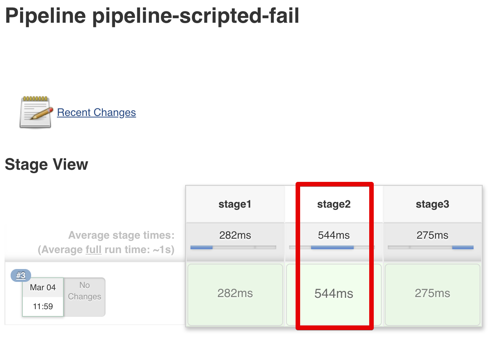
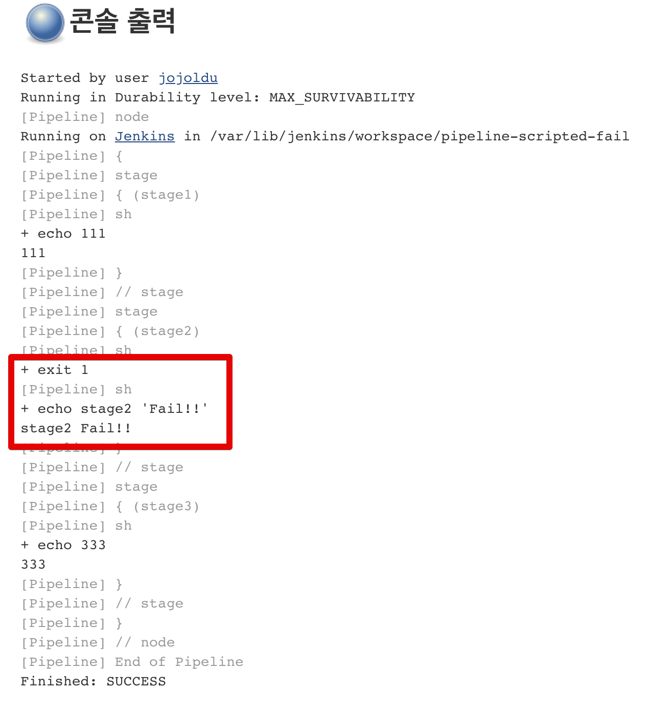

# 젠킨스에서 실패한 Job 무시하기

젠킨스에서 파이프라인을 사용할 경우 여러개의 Job을 수행합니다. 
  
일반적으로 젠킨스의 파이프라인은 빌드-배포에 맞춰져있어, 앞의 Job이 실패하면 뒤 Job들이 실행하지 않도록 하는 것을 기본으로 합니다.  
  
이때 각 Job이 실패하더라도 뒤에 있는 Job들을 계속 실행할 수 있는 방법이 필요할때가 있는데요.  
  
예를 들어 Batch 작업들이 순차적으로 실행되지만, 각 Batch들이 서로 연관관계가 없을 경우 앞이 실패한 것과 무관하게 실행되길 원합니다.  
이럴때 실패를 무시하고 다음 Job을 실행하는 방법을 소개드립니다.

## 1. Scripted 문법

Scripted 문법은 Groovy 언어를 사용하는 것과 비슷하다고 말씀드렸는데요.  

> 참고: [젠킨스 파이프라인 정리 - 2. Scripted 문법 소개](https://jojoldu.tistory.com/356)

일반적인 프로그래밍 언어에서 예외가 발생했을때 처리하는 것처럼 ```try~catch```로 실패를 예외처럼 잡고 다음을 실행할 수 있습니다.  
  
아래와 같이 **stage2에서 실패**하는 부분을 ```try~catch```로 감쌌습니다.  

```groovy
node {
    stage('stage1') {
        sh 'echo 111'
    }
    
    stage('stage2') {
        try {
            sh 'exit 1'
        } catch (e) {
            sh 'echo stage2 Fail!!'
        }
    }
    stage('stage3') {
        sh 'echo 333'
    }
}

```

이 파이프라인을 실행해보면 아래와 같이 성공적으로 stage2와 stage3이 실행되는 것을 확인할 수 있습니다.



콘솔 로그도 함께 확인해보시면 ```catch```의 코드가 잘 실행된 것을 알수있죠?




## 2. Declarative 문법

두번째는 Declarative 문법에서 실패를 무시하는 방법입니다.  
Declarative 문법은 Scripted과 달리 **정적**인 문법입니다.  
딱딱 정해진 룰 내에서만 작동하는데, 실패난 

```groovy
pipeline {
    agent any
    stages {
        stage("1") {
            steps {
                sh 'echo 111'
            }
        }
        stage("2") {
            steps {
                script {
                    try {
                        sh 'exit 1'
                    } catch (e) {
                        sh 'echo [222222]'
                    }
                }
            }
        }
        stage("3") {
            steps {
                sh 'echo 333'
            }
        }
    }
    post {
        failure {
            echo '>>>>>>>>>>>>>>>>>>>>>>> [Fail!!!!]'
        }
    }
}
```


```groovy
pipeline {
    agent any
    stages {
        stage("1") {
            steps {
                build(job: 'step1')
            }
        }
        stage("2") {
            steps {
                script {
                    try {
                        build(job: 'step2')
                    } catch (e) {
                        sh 'echo [222222 catch]'
                    }
                }
            }
        }
        stage("3") {
            steps {
                build(job: 'step3')
            }
        }
    }
    post {
        failure {
            echo '>>>>>>>>>>>>>>>>>>>>>>> [Fail!!!!]'
        }
    }
}
```

