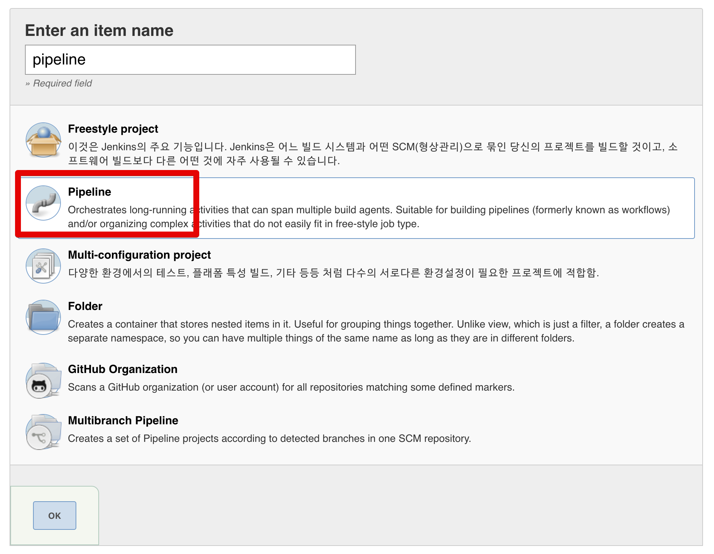
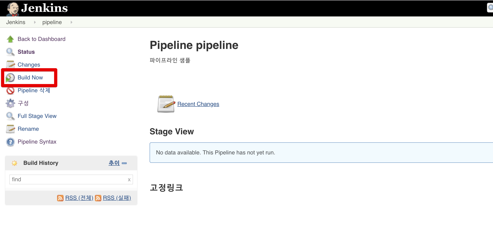
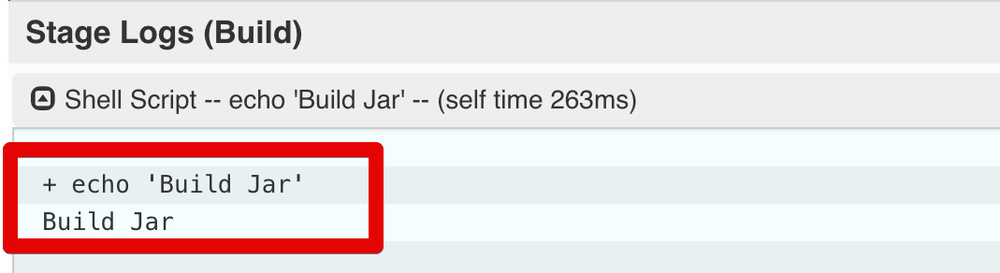

# 젠킨스 파이프라인 정리

안녕하세요? 이번 시간엔 젠킨스 파이프라인을 정리해보려고 합니다.  
모든 코드는 [Github](https://github.com/jojoldu/blog-code/tree/master/jenkins-pipeline)에 있기 때문에 함께 보시면 더 이해하기 쉬우실 것 같습니다.  
(공부한 내용을 정리하는 [Github](https://github.com/jojoldu/blog-code)와 세미나+책 후기를 정리하는 [Github](https://github.com/jojoldu/review), 이 모든 내용을 담고 있는 [블로그](http://jojoldu.tistory.com/)가 있습니다. )<br/>


## 1. 파이프라인 기초





```bash
node {
    stage('Ready') {
        sh "echo 'Ready'"
    }
    
    stage('Build') {
        sh "echo 'Build Jar'"
    }
    
    stage('Deploy') {
        sh "echo 'Deply AWS'"
    }
}
```







## 2. Declarative 문법

## 3. Scripted 문법


## 4. Jenkins Job들 순차 실행

## 5. Jenkins Job들 병렬 실행
 
 
## 참고

* [공식 문서 - Pipeline Syntax](https://jenkins.io/doc/book/pipeline/syntax/)

* [how-to-use-the-jenkins-scripted-pipeline)](https://www.blazemeter.com/blog/how-to-use-the-jenkins-scripted-pipeline)